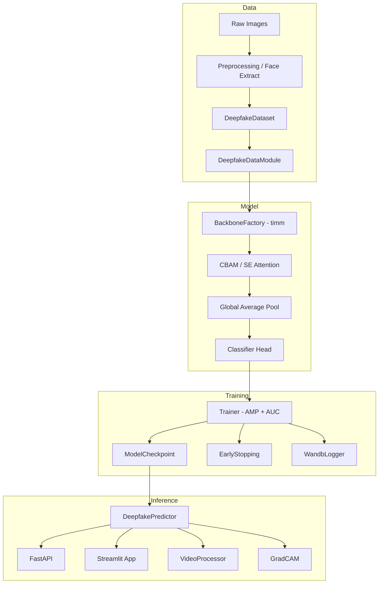

# Deepfake Shield

[](https://github.com/your-org/deepfake-shield/actions/workflows/ci.yml)


Production-ready deep learning pipeline for detecting AI-generated and manipulated face images.

## Architecture



## Project Tree

```
deepfake-shield/
├── app/                    # Streamlit demo
├── configs/                # YAML configs
├── data/                   # raw/ and processed/ datasets
├── docker/                 # Dockerfiles
├── models/                 # Saved checkpoints
├── notebooks/              # EDA notebooks
├── results/                # Evaluation outputs
├── scripts/                # train, evaluate, export CLIs
├── src/
│   ├── api/                # FastAPI service
│   ├── data/               # Dataset & datamodule
│   ├── evaluation/         # Metrics, GradCAM, robustness
│   ├── inference/          # Predictor & video pipeline
│   ├── models/             # Backbone, attention, classifier
│   └── training/           # Trainer, losses, callbacks
└── tests/
```

## Quick Start

### 1. Install

```bash
python -m venv venv
source venv/bin/activate  # Windows: venv\Scripts\activate
pip install -r requirements.txt
pip install -e .
```

### 2. Prepare Data

Organize images under `data/processed/`:

```
data/processed/train/{real,fake}/
data/processed/val/{real,fake}/
data/processed/test/{real,fake}/
```

### 3. Train

```bash
python scripts/train.py --config configs/base.yaml
```

### 4. Evaluate

```bash
python scripts/evaluate.py \
  --checkpoint models/checkpoints/best_model.pth \
  --test_dir data/processed/test
```

### 5. Export ONNX

```bash
python scripts/export.py --checkpoint models/final_model.pth
```

### 6. Run API

```bash
export DEEPFAKE_CHECKPOINT=models/checkpoints/best_model.pth
uvicorn src.api.main:app --host 0.0.0.0 --port 8000
```

### 7. Run Streamlit Demo

```bash
streamlit run app/streamlit_app.py
```

### 8. Docker

```bash
docker build -f docker/Dockerfile.api -t deepfake-shield-api .
docker run -p 8000:8000 -v $(pwd)/models:/app/models deepfake-shield-api
```

## Results

| Model | Backbone | AUC | EER | F1 |
|-------|----------|-----|-----|-----|
| v1.0  | convnext_tiny | — | — | — |

> Fill in after training on your dataset.

## Citation

```bibtex
@software{deepfake_shield2026,
  title  = {Deepfake Shield: Deep Learning Pipeline for Deepfake Detection},
  author = {Deepfake Shield Team},
  year   = {2026},
  url    = {https://github.com/your-org/deepfake-shield}
}
```

## License

MIT
